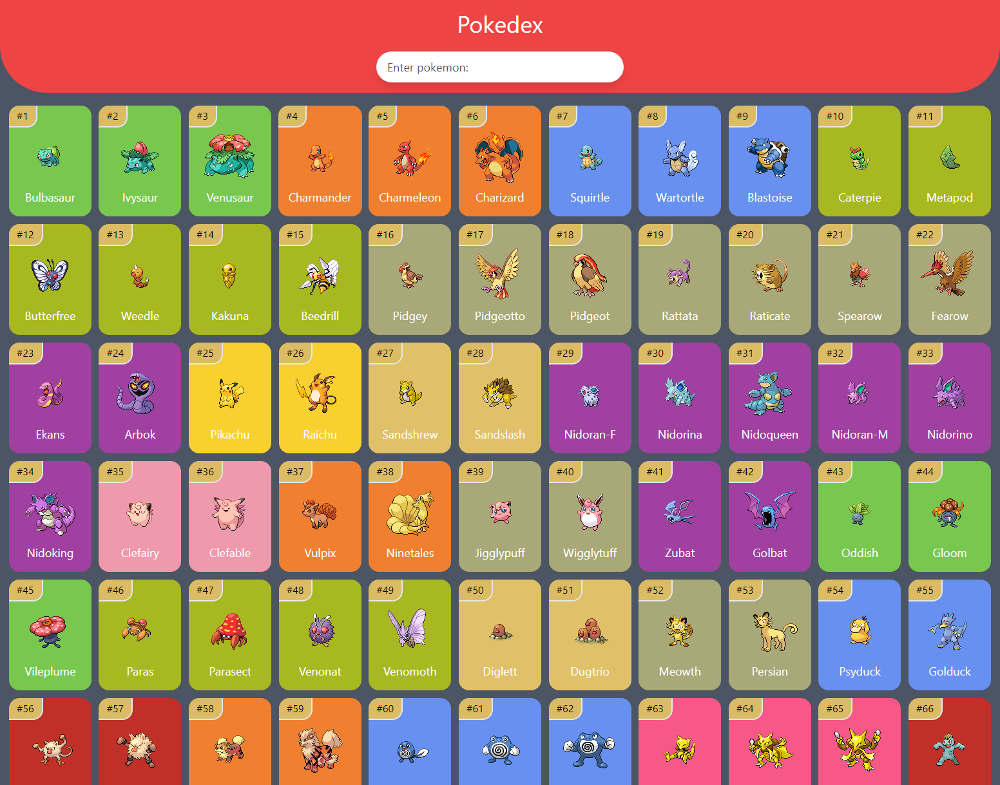
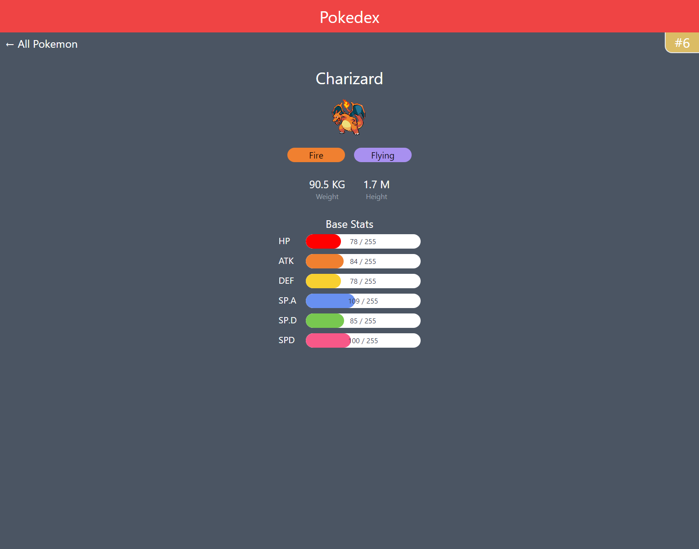

  <a href="https://thierrywanless.github.io/pokedex">
    <h1 align="center">Pokedex</h1>
  </a>

 

Live version: <a href="https://thierrywanless.github.io/pokedex">Pokedex</a>

## Overview

A Pokedex application implemented using [React](https://reactjs.org), [Tailwind CSS](https://tailwindcss.com) and [PokeAPI](https://pokeapi.co).

Homepage             |  About Pokemon
:-------------------------:|:-------------------------:
  |  

## API

PokeAPI supplies the pokemon data, with a local store of Pokemon Sprites supplied by the [PokeAPI Sprites package](https://github.com/PokeAPI/sprites). 

[React-Query](https://github.com/tannerlinsley/react-query) and local sprites are used to cache requests and avoid spamming the
PokeAPI as per their [Fair Use Policy](https://pokeapi.co/docs/v2#fairuse).

## Development

### `yarn start`

To run the app locally, first clone the repository. Then run `yarn start` to run the site on `https://localhost:3000`.

The site will reload automatically as changes are made.

### `yarn build`

Builds the site for production, outputting in the `build` folder. See: [Production Build](https://create-react-app.dev/docs/production-build/) for more information.

## Deployment

Deployment configuration: `./github/workflows/main.yml`

Deployment setup using GitHub Pages, and action: [peaceiris/actions-gh-pages](https://github.com/peaceiris/actions-gh-pages)

When committing to master, the action will automatically grab the latest version and publish to GitHub pages.

## Create React App

This project was bootstrapped with [Create React App](https://github.com/facebook/create-react-app).
